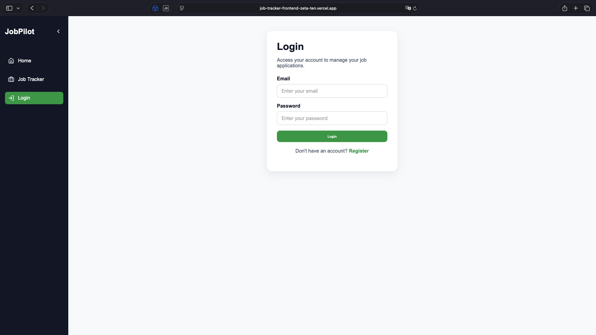
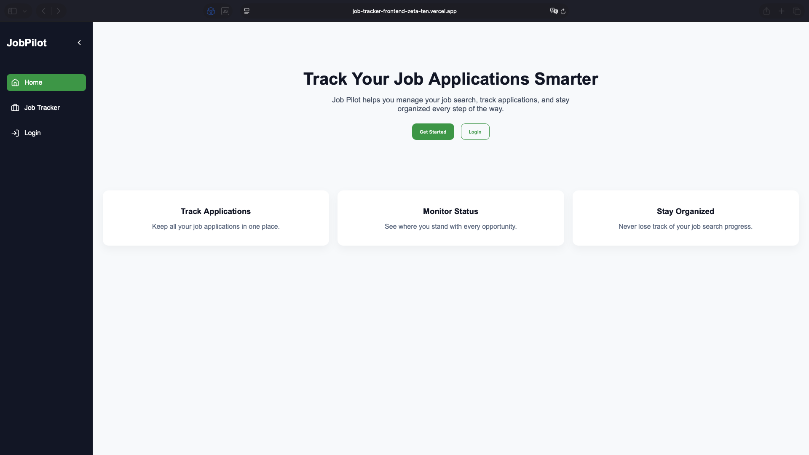
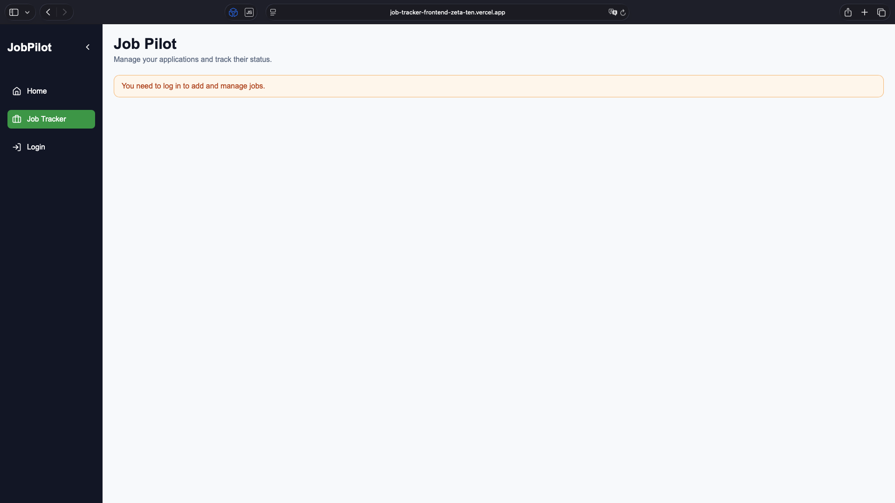
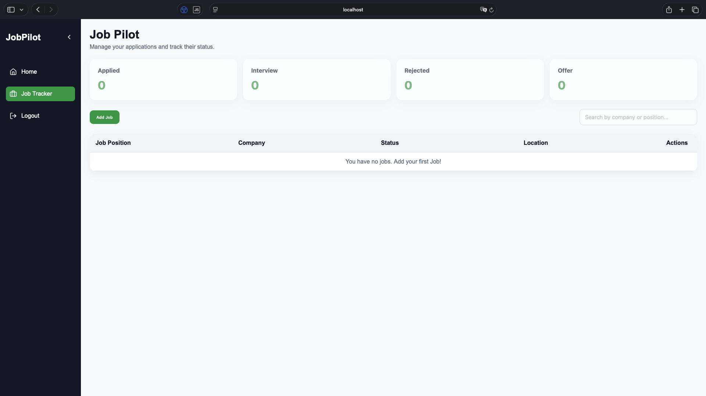
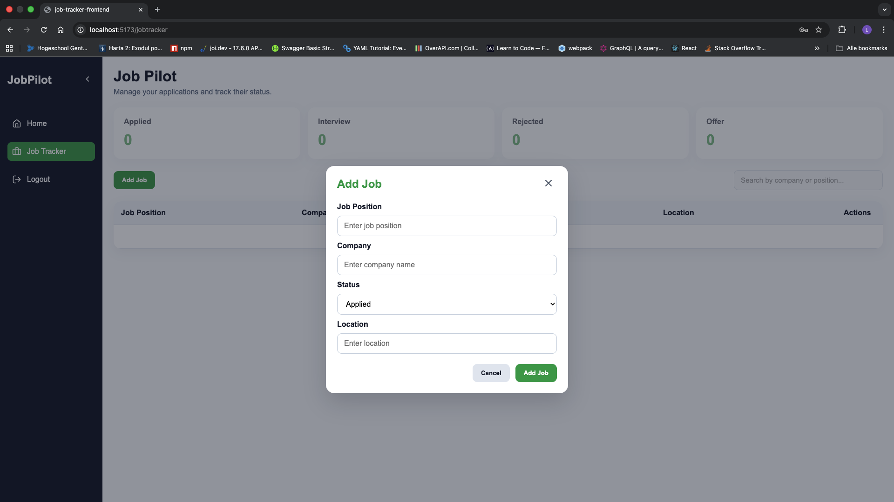
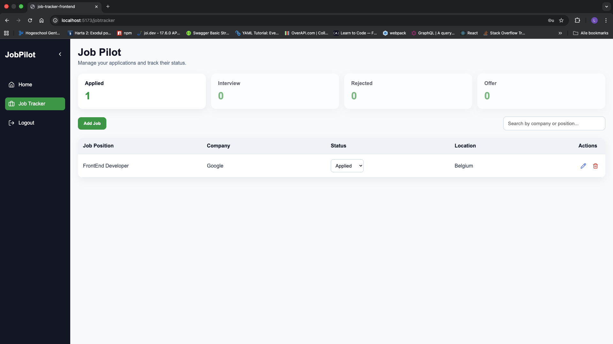
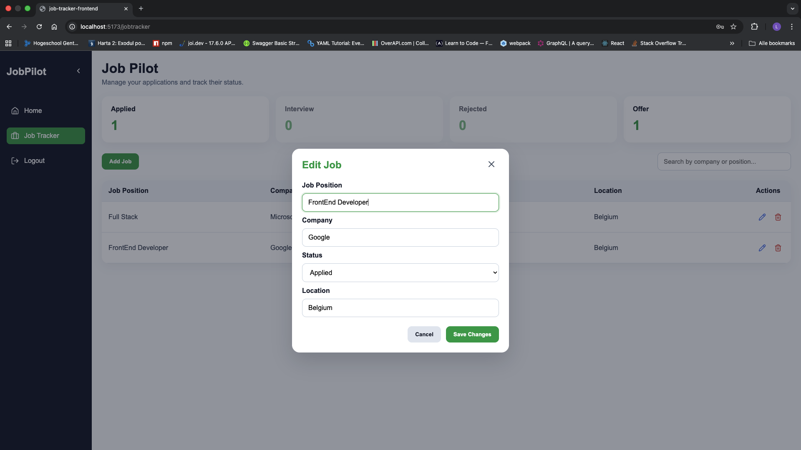
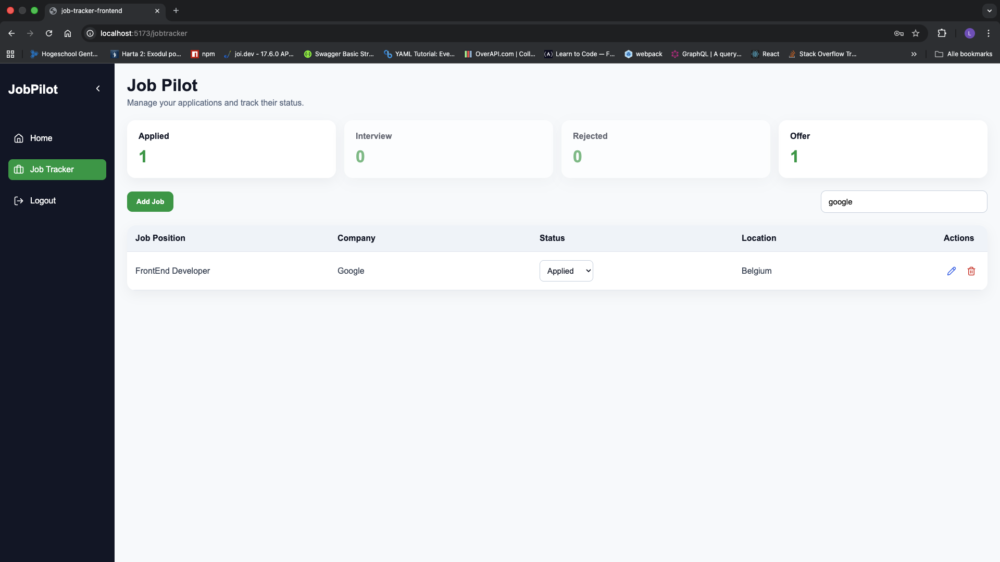

# 🎯 Job Tracker (React)

A modern and responsive frontend application built with **React** for managing and tracking job applications, powered by a **.NET backend API.**


---

## 📌 Overview

The Job Tracker provides a clean and intuitive user interface for organizing job applications, tracking their status, and managing the job search process efficiently.

This application communicates with a custom-built **ASP.NET Core API** and focuses on usability, state management, and a smooth user experience.

---

## 🚀 Live Demo

https://job-tracker-frontend-zeta-ten.vercel.app

--- 


## ✨ Features

### 🔐 Authentication

- User login & registration
- JWT-based authentication
- Persistent login state
- Protected routes


### 📊 Dashboard

Visual overview of job statuses:
    - Applied
    - Interview
    - Rejected
    - Offer

- Dynamic counters updated in real-time
- Clickable status filters

#### 💼 Job Management

- Add new job via modal form
- Edit job details
- Quick status update directly from table
- Delete jobs

### 🔍 Filtering & Search

- Filter jobs by status (dashboard cards)
- Search jobs by:
    - Company
    - Position
- Debounced search input for better performance

### 🧠 UX Improvements

- Disabled states when no data available
- Inline form validation
- Smooth UI transitions
- Responsive layout
- Sidebar with collapse/expand functionality

---

## 🛠 Tech Stack

- React (Vite)
- React Router
- Context API (Auth management)
- Axios (API calls)
- CSS (custom styling)
- Lucide Icons

--- 

## ⚙️ Getting Started

Follow the steps below to run the project locally:


```bash
# 1.Clone the repository
git clone https://github.com/YOUR_USERNAME/job-tracker-frontend.git
cd job-tracker-frontend

# 2.Install dependencies
npm install

# 3. Configure API base URL

Update the API base URL in:

src/services/api.js

Example:

const api = axios.create({
  baseURL: "http://localhost:5109/api",
});


# 4. Run the application
npm run dev

App will run on:

http://localhost:5173
```

---

## 🔐 Authentication Flow

1.User registers or logs in
2.API returns JWT token
3.Token is stored in localStorage
4.AuthContext manages global auth state
5.Protected routes restrict access to job features

--- 

## 📊 Key Components

### 🧩 Sidebar

- Collapsible navigation
- Icon-based when minimized
- Active route highlighting

### 📌 Status Dashboard

- Displays job counts by status
- Click to filter jobs
- Disabled when no jobs available

### 📋 Jobs Table

- Displays job list
- Inline status update
- Edit & delete actions

### 📝 Job Modal

- Add & edit job form
- Field-level validation
- Minimal layout shift on error display

---

## 🚀 Performance Optimizations

- Debounced search input
- Controlled API calls
- Efficient state updates
- Minimal re-renders

---

## 🎨 UI Design

- Dark sidebar with green accents
- Clean and minimal layout
- Responsive spacing
- Subtle animations and hover effects

---

## 🔗 Backend Integration

This frontend is connected to a custom **.NET Job Tracker API.**

Supported backend features:

- Authentication endpoints
- Job CRUD operations
- Status filtering
- Search by company or position

---

## 📈 Future Improvements

- Pagination
- Sorting
- Drag-and-drop status updates
- Notifications system
- Dark/light theme toggle

---

## 📸 Screenshots

### Desktop Auth



### Desktop 











--- 

## ⚠️ Note 
- Native form elements may appear slightly different across browsers (Safari vs Chrome), which is expected behavior.

---

## 👤 Author

Natanael Dobie
Frontend Developer -> Full-Stack Developer

- GitHub: https://github.com/TheDutchman68
- LinkedIn: www.linkedin.com/in/natanael-dobie-776059249
- Portfolio: https://portfolio-react-nu-taupe.vercel.app

---


## 📄 License

This project is licensed under the MIT License.